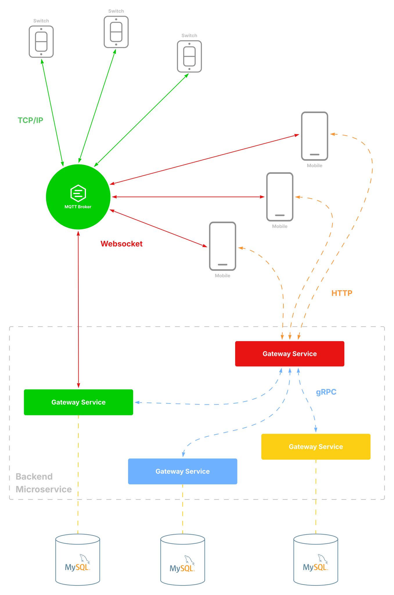

#### ĐỒ ÁN CHUYÊN NGÀNH 
# XÂY DỰNG HỆ THỐNG ĐIỀU KHIỂN CÔNG TẮC TỪ XA CHO THIẾT BỊ ĐIỆN DÂN DỤNG
Ý tưởng bắt nguồn từ nhu cầu thực tế của bản thân về việc quản lý máy tính cá nhân từ xa, dù đang ở trường hay khi trở về quê thăm gia đình. Hơn thế nữa việc này vượt trên cả giải pháp cho các nhu cầu tiện ích cá nhân, dự án còn phản ánh mong muốn chủ động tích hợp chuyển đổi số vào đời sống thường nhật, hướng đến việc tối ưu hóa và làm phong phú thêm trải nghiệm sống. 

Về mặt kỹ thuật thì đây là điều quan trọng, là một bước đi cần thiết để tôi tiếp cận, nghiên cứu sâu rộng các công nghệ phổ biến cho backend không chỉ dừng lại ở mức độ Website mà còn sang các lĩnh vực khác điển hình là IoT trong dự án này, từ đó không chỉ mở rộng tầm nhìn mà còn bồi đắp năng lực phân tích, nhằm đưa ra những giải pháp đột phá và hiệu quả hơn cho các dự án kế tiếp.
## 1. Mục Lục
1. [Mục Lục](#1-mục-lục)
2. [Tổng Quan Dự Án](#2-tổng-quan-dự-án)
3. [Phần Mềm Điều Khiển](#3-phần-mềm-điều-khiển)

    3.1 [Màn hình chính](#31-màn-hình-chính)

    3.2 [Màn hình chuyên](#32-màn-hình-chuyên)

    3.3 [Màn hình thiết đặt thiết bị](#33-màn-hình-thiết-đặt-thiết-bị)

4. [Quy Tắc Về Dự Án Với Git](#4-quy-tắc-về-dự-án-với-git)

    4.1 [Thông Tin Các Nhánh)](#41-thông-tin-các-nhánh)

    4.2 [Quy Tắc Làm Việc Với Nhánh](#42-quy-tắc-làm-việc-với-nhánh)

    4.3 [Quy Tắc Viết Thông Điệp Commit](#43-quy-tắc-viết-thông-điệp-commit)
## 2. Tổng Quan Dự Án
Dự án này là một giải pháp IoT thông minh, cho phép người dùng tắt/mở các thiết bị điện dân dụng như máy bơm nước, đèn chiếu sáng, máy lạnh, máy quạt,… từ bất kỳ đâu, thông qua một ứng dụng trên thiết bị di động Android.

Điểm nổi bật của hệ thống không nằm ở phần cứng phức tạp, mà nằm ở khả năng phản hồi tức thời, hoạt động ổn định và liên tục, bất chấp thiết bị được đặt ở đâu trên thế giới, miễn là có kết nối Internet. Người dùng không cần phải thực hiện bất kỳ cấu hình mạng cục bộ nào – hệ thống hoạt động hoàn toàn tự động và xuyên suốt qua Internet.

Mô hình tổng quát hệ thống:

<p align="center">
    
</p>

Về mặt kỹ thuật hệ thống này thiết kế theo kiến trúc microservices, nơi các thành phần như thiết bị IoT, backend xử lý, và ứng dụng người dùng được tách biệt rõ ràng nhưng được lập trình để chúng đồng bộ với nhau một cách nhanh chóng (Tốc độ gần như mô hình Monolithic thông thường) nhờ nghiên cứu - lựa chọn hạ tầng truyền thông mạnh mẽ và phù hợp.

Dự án ứng dụng nhiều giao thức truyền thông khác nhau, đảm bảo khả năng truyền tải thông điệp nhanh chóng, đáng tin cậy và tương thích cao giữa các thành phần trong hệ thống. Trong đó, MQTT Broker đóng vai trò trung tâm – là cầu nối giao tiếp giúp thiết bị và server có thể truyền – nhận dữ liệu hiệu quả ngay cả khi:

- Thiết bị sử dụng IP động (thường gặp trong mạng Internet dân dụng),

- Đường truyền gặp gián đoạn tạm thời,

- Cần mở rộng hệ thống mà không ảnh hưởng đến kiến trúc ban đầu.

Nhờ vào MQTT mà hệ thống này có thể triển khai nhiều giao thức cho nhiều mục đích khác nhau nhưng vẫn đảm bảo sự hiệu quả và tương thích tốt.

## 3. Phần Mềm Điều Khiển
Do giới hạn về ngân sách, phần mềm điều khiển chỉ mới được phát triển trên nền tảng Android, sử dụng React Native kết hợp với Expo nhằm rút ngắn thời gian phát triển.

Giao diện người dùng (UI) của phần mềm được lấy cảm hứng từ phần mềm tương tự, “Home” của Apple là một phần mềm cho nhà thông minhy được phần lớn mọi người đánh giá là đẹp - hiện đại - khá thu hút. Nhưng phần mềm "Home" được thiết kế cho đa số người dùng trên thế giới nên có nhiều trải nghiệm chưa thật sự phù hợp với người Việt. Qua sự trải nghiệm sử dụng của cá nhân trên nhiều phần mềm tương tự, với tiêu chí phần mềm của tôi là "Đơn giản - dễ hiểu - tối thiểu". Từ đó tôi đã kế thừa lại UX của phần mềm "Home" và kết hợp nó với UX mà tôi đúc kết được thì một số hình ảnh quan trọng của phần mềm hoàn chỉnh như sau:

![ui app controll on android device!][def_2] 

[def_2]: /assets/ui-app-controll-on-android-device.svg

### 3.1. Màn hình chính

- Điều nột bật nhất tại màn hình này là cho phép điều khiển nhanh các thiết bị đã kết nối và xem rõ các thông tin cần thiết nhất của thiết bị. 
- Trang này được thiết kế sao cho người dùng có thể dễ dàng truy cập được hầu hết các tính năng quan trọng với tối thiểu thao tác nhất (nhiều nhất 2 thao tác).

### 3.2. Màn hình chuyên

Đây là màn hình có nội dung không cố định, tùy vào loại thiết bị sẽ có một cách thiết kế khác nhau. Hiện tại dự án này chỉ xây dựng thiết bị là công tắc.

### 3.3. Màn hình thiết đặt thiết bị

Màn hình này được xem như là "hồ sơ" và "luật" dành cho thiết bị đó. Đầu tiên ta dễ dàng xem được lịch sử hoạt động của thiết bị 24/7 (Cũng giống như "Màn hình chuyên", tùy thuộc vào thiết bị sẽ có giao diện hiển thị lịch sử riêng biệt). Điều quan trọng tại màn hình này ta có thể thiết đặt cho thiết bị nhớ trạng thái của nó trước khi xảy ra sự cố (điển hình là hiện tượng nháy điện và mất điện) sau khi được cung cấp lại nguồn điện thiết bị sẽ khôi phục về trạng thái đã được ghi nhận. Do thiết bị được thiết kế để có thể tái sử dụng cho nên việc bảo vệ thiết bị trước sự đánh cắp là điều bắt buộc phải có, đó là tính năng reset thiết bị và chống reset thiết bị ngay trên phần mềm.

## 4. Quy Tắc Về Dự Án Với Git
### 4.1 Thông Tin Các Nhánh
-   `main` các tài nguyên hoàn thiện của dự án (Theo từng giai đoạn), nhánh này không được thay đổi trực tiếp (Ngoại trừ lần đầu tạo repository) mà chỉ được tạo nên nhờ gộp các nhánh con trực tiếp.
-   `dev` các tài nguyên về mặt coding
    -   Thư mục làm việc: `./src`
    -   Có 4 nhánh con:
        -   `app` chứa tài nguyên coding dành cho ứng dụng trên thiết bị di động (Android app). Thư mục làm việc `./src/app`
        -   `server` chứa tài nguyên coding cho server. Thư mục làm việc `./src/server`
        -   `mqtt` chứa tài nguyên xây dựng - cấu hình MQTT Broker. Thư mục làm việc: `./src/mqtt-broker`
        -   `devices` chứa tài nguyên cho các thiết bị vật lý trong dự án. Thực mục làm việc: `./src/devices`
-   `doc` các tài nguyên về mặt thông tin (Tài liệu dự án, giới thiệu dự án, bài báo cáo,...)
    - Thự mục làm việc: `./assets, ./propress-report, ./thesis`
-   `project-rework` tương tự như nhánh `dev` nhưng backend bằng NestJS được thay thế bằng Spring Boot, đồng thời tinh chỉnh các phần khác để đật được sự tương thích tốt nhất. Nhánh này được tạo ra nhằm mang đến sự lựa chọn thứ 2 (khắc phục vấn đề mạng yếu khi sử dụng với rRPC).
### 4.2 Quy Tắc Làm Việc Với Nhánh
Các nhánh con thuộc nhánh `dev` sẽ được gộp lại vào `dev` sau mỗi <b><u>giai đoạn testing</u></b>. Nếu có lỗi cần fix ngay thì quay về các nhánh con chính để sửa đổi và gộp lại vào nhánh `dev` để tiếp tục <b><u>giai đoạn testing</u></b>. Nếu lỗi lớn thì mang sang thực hiện sửa lỗi ở giai đoạn tiếp theo sau khi testing hoàn tất.

Sau khi kết thúc các <b><u>giai đoạn testing</u></b> nếu nội dung ở từng nhánh hoàn thiện thì tiến hành gộp vào nhánh main.
### 4.3 Quy Tắc Viết Thông Điệp Commit
Trong mỗi commit có thể có nhiều trạng thái code khác nhau vì thế mỗi trạng thái sẽ được gắn kèm tag và mô tả về code đó.
```terminal
$ git commit -m "[DEV] sign-up with Google, sign-in interface [FIX] visibility the password on sign-in"
```

Tag:
-   [DEV] code thông thường (bao gồm việc code các tính năng) hoặc bất cứ thứ gì thuộc code nhằm xây dựng dự án.
-   [REFACTOR] tái cấu trúc code nhưng không làm thay đổi tính năng trước đó.
-   [DOC] viết tài liệu hoặc các hoạt động ngoài code.
-   [FIX] các hoạt động sửa đổi code/tài liệu nhằm khắc phục lỗi đang tồn tại.